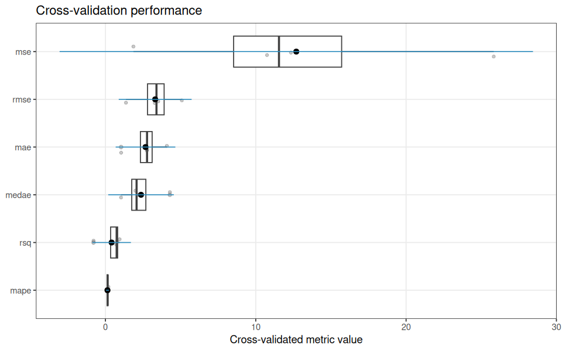
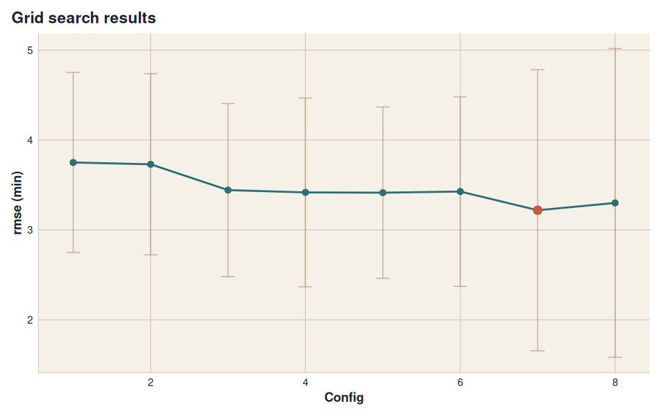
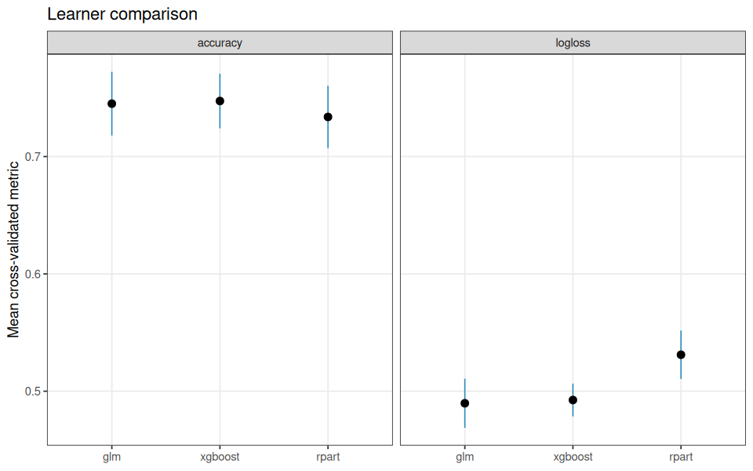
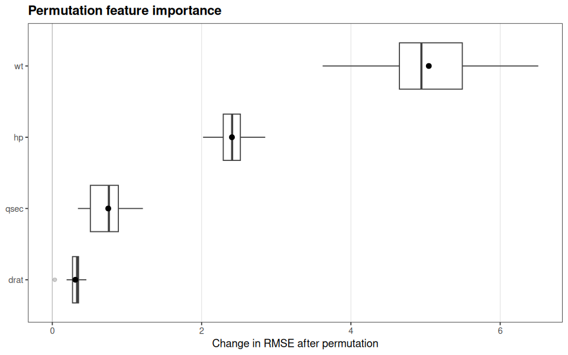
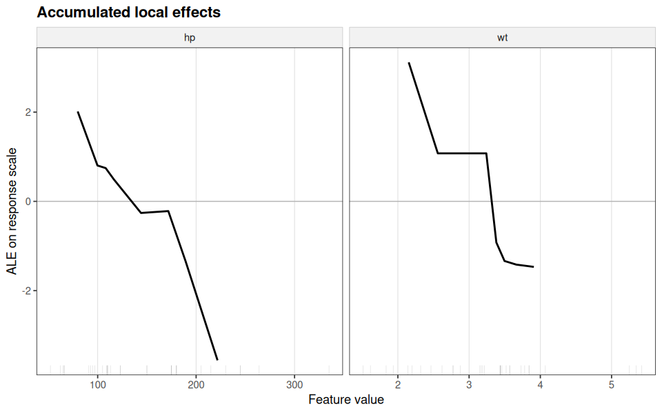
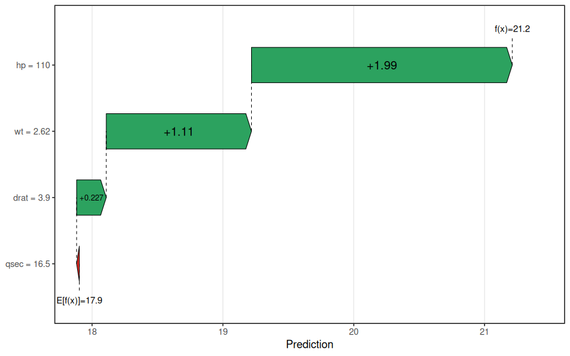
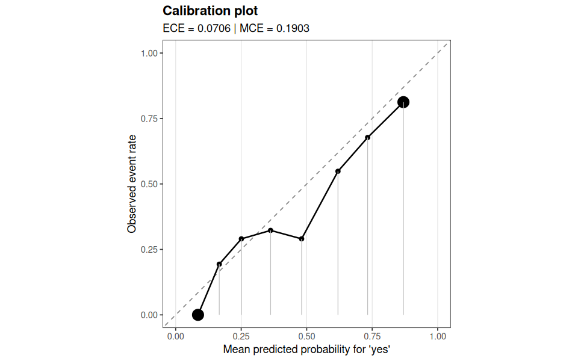
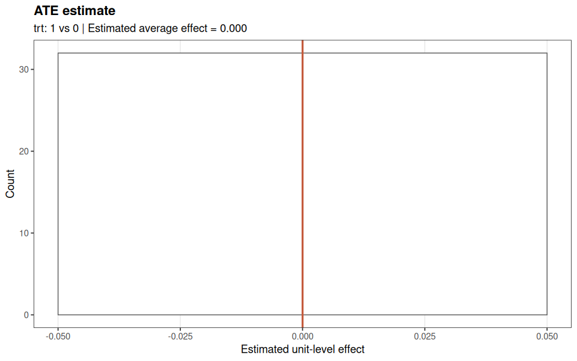

<!-- README.md is generated from README.Rmd. Please edit that file. -->

# funcml

`funcml` is a functional machine learning framework for R with one
explicit interface for fitting models, validating them, tuning them,
comparing learners, interpreting predictions, and estimating causal
effects.

The package is intentionally opinionated: preprocessing happens before
modeling, inputs stay explicit, and the API stays compact instead of
expanding into a large orchestration framework.

## Why `funcml`?

- One surface for the full modeling loop: `fit()`, `predict()`,
  `evaluate()`, `tune()`, `compare_learners()`, `interpret()`, and
  `estimate()`.
- Session-aware learner catalog via `list_learners()`, including
  capability and availability metadata.
- Plot-ready outputs across validation, tuning, comparison, explanation,
  calibration, and treatment-effect workflows.
- Native support for stacked and superlearner ensembles through the same
  interface as base learners.

## Installation

``` r
install.packages("remotes")
remotes::install_github("ielbadisy/funcml")
```

After installation, inspect the learner catalog with `list_learners()`.
This shows which learner ids are exposed through the compact `funcml`
API and which backends are available in the current R session.

## API Overview

| Task                 | Main functions                                               | Returned object                        | Typical use                                                         |
|----------------------|--------------------------------------------------------------|----------------------------------------|---------------------------------------------------------------------|
| Learner discovery    | `list_learners()`                                            | `data.frame`                           | Inspect learner ids, capabilities, and engine availability          |
| Model fitting        | `fit()`, `predict()`                                         | `funcml_fit`                           | Train one learner and generate predictions                          |
| Resampled validation | `cv()`, `holdout()`, `group_cv()`, `time_cv()`, `evaluate()` | `funcml_eval`                          | Estimate out-of-sample performance with uncertainty                 |
| Model selection      | `tune()`, `compare_learners()`                               | `funcml_tune`, `funcml_compare`        | Search hyperparameters and compare learners under common resampling |
| Interpretation       | `interpret()`                                                | method-specific interpretation classes | Explain fitted models with global and local diagnostics             |
| Causal estimation    | `estimate()`                                                 | `funcml_estimand`                      | Estimate plug-in g-computation estimands                            |

## Demo data used below

The README uses one regression problem, one binary classification
problem, and one synthetic causal example so the same API can be shown
across the package surface.

``` r
demo_reg <- transform(
  mtcars,
  car = rownames(mtcars)
)

demo_cls <- local({
  x1 <- rnorm(500)
  x2 <- rnorm(500)
  x3 <- runif(500, -1, 1)
  eta <- -0.4 + 1.0 * x1 - 0.8 * x2 + 0.7 * x3
  data.frame(
    outcome = factor(
      ifelse(runif(500) < stats::plogis(eta), "yes", "no"),
      levels = c("no", "yes")
    ),
    x1 = x1,
    x2 = x2,
    x3 = x3
  )
})

demo_cls_test <- local({
  x1 <- rnorm(250)
  x2 <- rnorm(250)
  x3 <- runif(250, -1, 1)
  eta <- -0.4 + 1.0 * x1 - 0.8 * x2 + 0.7 * x3
  data.frame(
    outcome = factor(
      ifelse(runif(250) < stats::plogis(eta), "yes", "no"),
      levels = c("no", "yes")
    ),
    x1 = x1,
    x2 = x2,
    x3 = x3
  )
})

demo_causal <- local({
  x1 <- rnorm(600)
  x2 <- rnorm(600)
  x3 <- runif(600, -1, 1)
  p_trt <- stats::plogis(-0.2 + 0.7 * x1 - 0.5 * x2 + 0.4 * x3)
  trt <- rbinom(600, 1, p_trt)
  true_effect <- 1.2 + 0.6 * x3
  outcome <- 3 + true_effect * trt + 0.8 * x1 - 0.7 * x2 + 0.5 * x3 +
    rnorm(600, sd = 0.4)
  data.frame(
    outcome = outcome,
    trt = trt,
    x1 = x1,
    x2 = x2,
    x3 = x3,
    true_effect = true_effect
  )
})
```

## 1. Inspect the learner catalog

`list_*()` follow a compact registry style by default.

``` r
list_learners()
#>         learner   fit   predict   tune has_fit has_predict has_tune available
#> 15     adaboost fit() predict() tune()    TRUE        TRUE     TRUE      TRUE
#> 22         bart fit() predict() tune()    TRUE        TRUE     TRUE      TRUE
#> 9           C50 fit() predict() tune()    TRUE        TRUE     TRUE      TRUE
#> 18      cforest fit() predict() tune()    TRUE        TRUE     TRUE      TRUE
#> 17        ctree fit() predict() tune()    TRUE        TRUE     TRUE      TRUE
#> 6     e1071_svm fit() predict() tune()    TRUE        TRUE     TRUE      TRUE
#> 11        earth fit() predict() tune()    TRUE        TRUE     TRUE      TRUE
#> 14          fda fit() predict() tune()    TRUE        TRUE     TRUE      TRUE
#> 12          gam fit() predict() tune()    TRUE        TRUE     TRUE      TRUE
#> 8           gbm fit() predict() tune()    TRUE        TRUE     TRUE      TRUE
#> 1           glm fit() predict() tune()    TRUE        TRUE     TRUE      TRUE
#> 3        glmnet fit() predict() tune()    TRUE        TRUE     TRUE      TRUE
#> 10         kknn fit() predict() tune()    TRUE        TRUE     TRUE      TRUE
#> 19          lda fit() predict() tune()    TRUE        TRUE     TRUE      TRUE
#> 21     lightgbm fit() predict() tune()    TRUE        TRUE     TRUE      TRUE
#> 13   naivebayes fit() predict() tune()    TRUE        TRUE     TRUE      TRUE
#> 5          nnet fit() predict() tune()    TRUE        TRUE     TRUE      TRUE
#> 16          pls fit() predict() tune()    TRUE        TRUE     TRUE      TRUE
#> 20          qda fit() predict() tune()    TRUE        TRUE     TRUE      TRUE
#> 7  randomForest fit() predict() tune()    TRUE        TRUE     TRUE      TRUE
#> 4        ranger fit() predict() tune()    TRUE        TRUE     TRUE      TRUE
#> 2         rpart fit() predict() tune()    TRUE        TRUE     TRUE      TRUE
#> 24     stacking fit() predict() tune()    TRUE        TRUE     TRUE      TRUE
#> 25 superlearner fit() predict() tune()    TRUE        TRUE     TRUE      TRUE
#> 23      xgboost fit() predict() tune()    TRUE        TRUE     TRUE      TRUE
```

``` r
list_tunable_learners()
#>         learner   fit   predict   tune has_fit has_predict has_tune available
#> 15     adaboost fit() predict() tune()    TRUE        TRUE     TRUE      TRUE
#> 22         bart fit() predict() tune()    TRUE        TRUE     TRUE      TRUE
#> 9           C50 fit() predict() tune()    TRUE        TRUE     TRUE      TRUE
#> 18      cforest fit() predict() tune()    TRUE        TRUE     TRUE      TRUE
#> 17        ctree fit() predict() tune()    TRUE        TRUE     TRUE      TRUE
#> 6     e1071_svm fit() predict() tune()    TRUE        TRUE     TRUE      TRUE
#> 11        earth fit() predict() tune()    TRUE        TRUE     TRUE      TRUE
#> 14          fda fit() predict() tune()    TRUE        TRUE     TRUE      TRUE
#> 12          gam fit() predict() tune()    TRUE        TRUE     TRUE      TRUE
#> 8           gbm fit() predict() tune()    TRUE        TRUE     TRUE      TRUE
#> 1           glm fit() predict() tune()    TRUE        TRUE     TRUE      TRUE
#> 3        glmnet fit() predict() tune()    TRUE        TRUE     TRUE      TRUE
#> 10         kknn fit() predict() tune()    TRUE        TRUE     TRUE      TRUE
#> 19          lda fit() predict() tune()    TRUE        TRUE     TRUE      TRUE
#> 21     lightgbm fit() predict() tune()    TRUE        TRUE     TRUE      TRUE
#> 13   naivebayes fit() predict() tune()    TRUE        TRUE     TRUE      TRUE
#> 5          nnet fit() predict() tune()    TRUE        TRUE     TRUE      TRUE
#> 16          pls fit() predict() tune()    TRUE        TRUE     TRUE      TRUE
#> 20          qda fit() predict() tune()    TRUE        TRUE     TRUE      TRUE
#> 7  randomForest fit() predict() tune()    TRUE        TRUE     TRUE      TRUE
#> 4        ranger fit() predict() tune()    TRUE        TRUE     TRUE      TRUE
#> 2         rpart fit() predict() tune()    TRUE        TRUE     TRUE      TRUE
#> 24     stacking fit() predict() tune()    TRUE        TRUE     TRUE      TRUE
#> 25 superlearner fit() predict() tune()    TRUE        TRUE     TRUE      TRUE
#> 23      xgboost fit() predict() tune()    TRUE        TRUE     TRUE      TRUE
```

``` r
list_learners(
  classification = TRUE,
  prob = TRUE,
  )
#>         learner   fit   predict   tune has_fit has_predict has_tune available
#> 15     adaboost fit() predict() tune()    TRUE        TRUE     TRUE      TRUE
#> 22         bart fit() predict() tune()    TRUE        TRUE     TRUE      TRUE
#> 9           C50 fit() predict() tune()    TRUE        TRUE     TRUE      TRUE
#> 18      cforest fit() predict() tune()    TRUE        TRUE     TRUE      TRUE
#> 17        ctree fit() predict() tune()    TRUE        TRUE     TRUE      TRUE
#> 6     e1071_svm fit() predict() tune()    TRUE        TRUE     TRUE      TRUE
#> 11        earth fit() predict() tune()    TRUE        TRUE     TRUE      TRUE
#> 12          gam fit() predict() tune()    TRUE        TRUE     TRUE      TRUE
#> 8           gbm fit() predict() tune()    TRUE        TRUE     TRUE      TRUE
#> 1           glm fit() predict() tune()    TRUE        TRUE     TRUE      TRUE
#> 3        glmnet fit() predict() tune()    TRUE        TRUE     TRUE      TRUE
#> 10         kknn fit() predict() tune()    TRUE        TRUE     TRUE      TRUE
#> 19          lda fit() predict() tune()    TRUE        TRUE     TRUE      TRUE
#> 21     lightgbm fit() predict() tune()    TRUE        TRUE     TRUE      TRUE
#> 13   naivebayes fit() predict() tune()    TRUE        TRUE     TRUE      TRUE
#> 5          nnet fit() predict() tune()    TRUE        TRUE     TRUE      TRUE
#> 20          qda fit() predict() tune()    TRUE        TRUE     TRUE      TRUE
#> 7  randomForest fit() predict() tune()    TRUE        TRUE     TRUE      TRUE
#> 4        ranger fit() predict() tune()    TRUE        TRUE     TRUE      TRUE
#> 2         rpart fit() predict() tune()    TRUE        TRUE     TRUE      TRUE
#> 24     stacking fit() predict() tune()    TRUE        TRUE     TRUE      TRUE
#> 25 superlearner fit() predict() tune()    TRUE        TRUE     TRUE      TRUE
#> 23      xgboost fit() predict() tune()    TRUE        TRUE     TRUE      TRUE
```

``` r
list_interpretability_methods()
#>                                  compute   plot has_compute has_plot
#> 1              interpret(method = "vip") plot()        TRUE     TRUE
#> 2          interpret(method = "permute") plot()        TRUE     TRUE
#> 3              interpret(method = "pdp") plot()        TRUE     TRUE
#> 4              interpret(method = "ice") plot()        TRUE     TRUE
#> 5              interpret(method = "ale") plot()        TRUE     TRUE
#> 6            interpret(method = "local") plot()        TRUE     TRUE
#> 7             interpret(method = "lime") plot()        TRUE     TRUE
#> 8             interpret(method = "shap") plot()        TRUE     TRUE
#> 9      interpret(method = "local_model") plot()        TRUE     TRUE
#> 10     interpret(method = "interaction") plot()        TRUE     TRUE
#> 11       interpret(method = "surrogate") plot()        TRUE     TRUE
#> 12         interpret(method = "profile") plot()        TRUE     TRUE
#> 13 interpret(method = "ceteris_paribus") plot()        TRUE     TRUE
#> 14     interpret(method = "calibration") plot()        TRUE     TRUE
```

``` r
list_metrics()
#>               metric direction
#> 1               rmse  minimize
#> 2                mae  minimize
#> 3                mse  minimize
#> 4              medae  minimize
#> 5               mape  minimize
#> 6                rsq  maximize
#> 7           accuracy  maximize
#> 8          precision  maximize
#> 9             recall  maximize
#> 10       specificity  maximize
#> 11                f1  maximize
#> 12 balanced_accuracy  maximize
#> 13           logloss  minimize
#> 14             brier  minimize
#> 15               auc  maximize
#> 16      auc_weighted  maximize
#> 17               ece  minimize
#> 18               mce  minimize
#>                                                       summary     range
#> 1         Root mean squared error for regression predictions.  [0, Inf)
#> 2             Mean absolute error for regression predictions.  [0, Inf)
#> 3              Mean squared error for regression predictions.  [0, Inf)
#> 4           Median absolute error for regression predictions.  [0, Inf)
#> 5  Mean absolute percentage error for regression predictions.  [0, Inf)
#> 6    Coefficient of determination for regression predictions. (-Inf, 1]
#> 7                                    Classification accuracy.    [0, 1]
#> 8                    Macro-averaged classification precision.    [0, 1]
#> 9                       Macro-averaged classification recall.    [0, 1]
#> 10                 Macro-averaged classification specificity.    [0, 1]
#> 11                                   Macro-averaged F1 score.    [0, 1]
#> 12                          Macro-averaged balanced accuracy.    [0, 1]
#> 13  Negative log-likelihood for classification probabilities.  [0, Inf)
#> 14              Brier score for classification probabilities.    [0, 2]
#> 15                                  Area under the ROC curve.    [0, 1]
#> 16              Weighted multiclass area under the ROC curve.    [0, 1]
#> 17      Expected calibration error for binary classification.    [0, 1]
#> 18       Maximum calibration error for binary classification.    [0, 1]
```

## 2. Fit one model and inspect the fitted object

`fit()` is the entry point for training a single learner. It returns a
compact `funcml_fit` object that stores the learner id, formula, encoded
feature layout, and prediction machinery.

``` r
xgb_spec <- list(
  nrounds = 30,
  max_depth = 3,
  eta = 0.1,
  subsample = 1,
  colsample_bytree = 1
)

fit_obj <- fit(
  mpg ~ wt + hp + qsec + drat,
  data = demo_reg,
  model = "xgboost",
  spec = xgb_spec,
  seed = 42
)

fit_obj
#> <funcml_fit> regression model: xgboost
#> Formula: mpg ~ wt + hp + qsec + drat
#> Features: 4 | Obs: 32
```

``` r
predict(fit_obj, demo_reg[1:6, ])
#> [1] 21.20948 21.20948 22.52156 21.27151 17.83478 18.34501
```

## 3. Validate performance with resampling

`evaluate()` applies the same learner interface under a resampling plan
and returns fold-level results plus uncertainty summaries.

``` r
eval_obj <- evaluate(
  data = demo_reg,
  formula = mpg ~ wt + hp + qsec + drat,
  model = "xgboost",
  spec = xgb_spec,
  resampling = cv(v = 4, seed = 42)
)

eval_obj
#> <funcml_eval> model: xgboost | task: regression
#>   metric       mean         sd n  std_error conf_level    conf_low  conf_high
#> 1   rmse  3.3098266 1.52367053 4 0.76183527       0.95  0.88532681  5.7343265
#> 2    mae  2.6666687 1.24734293 4 0.62367146       0.95  0.68186772  4.6514696
#> 3    mse 12.6961313 9.89521740 4 4.94760870       0.95 -3.04936773 28.4416303
#> 4  medae  2.3683064 1.37102015 4 0.68551008       0.95  0.18670736  4.5499054
#> 5   mape  0.1375875 0.05773173 4 0.02886587       0.95  0.04572342  0.2294516
#> 6    rsq  0.4117001 0.80640932 4 0.40320466       0.95 -0.87147708  1.6948773
```

``` r
plot(eval_obj)
```

<!-- -->

The same resampling interface also handles grouped CV, rolling time
splits, and plain holdout validation through `group_cv()`, `time_cv()`,
and `holdout()`.

## 4. Tune hyperparameters and compare learners

`tune()` searches a grid or random sample of hyperparameters using the
same evaluation machinery. `compare_learners()` then puts multiple
learners under the same resampling design for an apples-to-apples
comparison.

``` r
tune_grid <- expand.grid(
  max_depth = c(2, 3),
  eta = c(0.05, 0.1),
  nrounds = c(20, 30)
)

tune_obj <- tune(
  data = demo_reg,
  formula = mpg ~ wt + hp + qsec + drat,
  model = "xgboost",
  grid = tune_grid,
  resampling = cv(v = 3, seed = 42),
  metric = "rmse",
  subsample = 1,
  colsample_bytree = 1,
  seed = 42
)

tune_obj
#> <funcml_tune> metric=rmse direction=min search=grid
#> Best:
#>   max_depth eta nrounds     mean       sd n std_error conf_level    conf_low
#> 7         2 0.1      30 2.938398 1.205848 3 0.6961968       0.95 -0.05709457
#>   conf_high
#> 7  5.933891
```

``` r
plot(tune_obj)
```

<!-- -->

``` r
compare_obj <- compare_learners(
  data = demo_reg,
  formula = mpg ~ wt + hp + qsec,
  models = c("glm", "rpart", "xgboost"),
  metrics = c("rmse", "mae"),
  resampling = cv(v = 4, seed = 42),
  specs = list(xgboost = xgb_spec)
)

compare_obj
#> <funcml_compare> task: regression | tuned: FALSE
#>     model metric     mean        sd n std_error conf_level  conf_low conf_high
#> 1     glm   rmse 2.823282 0.8391539 4 0.4195769       0.95 1.4880008  4.158563
#> 2     glm    mae 2.324837 0.6977166 4 0.3488583       0.95 1.2146141  3.435060
#> 3   rpart   rmse 4.589988 0.5112815 4 0.2556408       0.95 3.7764255  5.403552
#> 4   rpart    mae 3.781101 0.3039781 4 0.1519891       0.95 3.2974042  4.264798
#> 5 xgboost   rmse 3.374909 1.4559200 4 0.7279600       0.95 1.0582155  5.691603
#> 6 xgboost    mae 2.734509 1.1846891 4 0.5923445       0.95 0.8494044  4.619614
#>   tuned rank
#> 1 FALSE    1
#> 2 FALSE    1
#> 3 FALSE    3
#> 4 FALSE    3
#> 5 FALSE    2
#> 6 FALSE    2
```

``` r
plot(compare_obj)
```

<!-- -->

## 5. Interpret a fitted model

The interpretation layer operates directly on fitted `funcml_fit`
objects, so you do not need a second modeling interface for explanation
tasks.

``` r
permute_obj <- interpret(
  fit = fit_obj,
  data = demo_reg,
  method = "permute",
  nsim = 20,
  seed = 42
)

summary(permute_obj)
#>   feature importance    std_dev
#> 1      wt  5.0435220 0.66524640
#> 2      hp  2.4062084 0.21645730
#> 3    qsec  0.7493847 0.26214864
#> 4    drat  0.3088876 0.09418153
```

``` r
plot(permute_obj)
```

<!-- -->

``` r
ale_obj <- interpret(
  fit = fit_obj,
  data = demo_reg,
  method = "ale",
  features = c("wt", "hp")
)
```

``` r
plot(ale_obj)
```

<!-- -->

``` r
shap_obj <- interpret(
  fit = fit_obj,
  data = demo_reg,
  method = "shap",
  newdata = demo_reg[1,],
  nsim = 30,
  nsamples = 20,
  seed = 42
)
```

``` r
plot(shap_obj, kind = "waterfall")
```

<!-- -->

Other supported methods include PDP, ICE, local surrogate explanations,
global surrogates, interaction strength, ceteris paribus profiles, and
calibration diagnostics.

## 6. Inspect class probabilities and calibration

For classification, the same `fit()` object can produce class
predictions or class-probability matrices with aligned columns.

``` r
cls_fit <- fit(
  outcome ~ x1 + x2 + x3,
  data = demo_cls,
  model = "glm",
  seed = 42
)

cls_prob <- predict(cls_fit, demo_cls_test[1:6, , drop = FALSE], type = "prob")

data.frame(
  prob_no = cls_prob[, "no"],
  prob_yes = cls_prob[, "yes"],
  row.names = NULL
)
#>     prob_no  prob_yes
#> 1 0.5783619 0.4216381
#> 2 0.3225988 0.6774012
#> 3 0.8395363 0.1604637
#> 4 0.4916897 0.5083103
#> 5 0.7620232 0.2379768
#> 6 0.5671560 0.4328440
```

``` r
calibration_obj <- interpret(
  fit = cls_fit,
  data = demo_cls_test,
  method = "calibration",
  type = "prob",
  bins = 8,
  strategy = "quantile"
)
```

``` r
plot(calibration_obj)
```

<!-- -->

## 7. Estimate causal effects through the same interface

`estimate()` extends the same framework into plug-in g-computation for
common binary-treatment estimands.

This synthetic causal example has measured confounding and a known
treatment effect centered near `1.2`, so the ATE output has a meaningful
target.

``` r
est_obj <- estimate(
  data = demo_causal,
  formula = outcome ~ trt + x1 + x2 + x3 + trt:x3,
  model = "glm",
  estimand = "ATE",
  treatment_level = 1,
  control_level = 0,
  interval = "normal",
  seed = 42
)

est_obj
#> <funcml_estimand> ATE via g-computation
#> Treatment: trt (1 vs 0)
#> Estimate: 1.2149 | SE: 0.0123 | 95% normal CI [1.1907, 1.2390]
```

``` r
plot(est_obj)
```

<!-- -->

The same API also supports `ATT`, `CATE`, and `IATE`.

## 8. Use ensembles as first-class learners

`stacking` and `superlearner` live in the same catalog as the base
learners, so ensembles are fit through the same API rather than a
separate pipeline.

``` r
stack_fit <- fit(
  mpg ~ wt + hp + qsec + drat,
  data = demo_reg,
  model = "stacking",
  spec = list(
    learners = c("glm", "rpart", "xgboost"),
    learner_specs = list(xgboost = xgb_spec),
    meta_model = "glmnet"
  ),
  seed = 42
)

predict(stack_fit, demo_reg[1:5, ])
#> [1] 21.33335 21.39537 22.18028 21.60285 17.50703
```

## 9. Summary

`funcml` is designed around these core functions:

- one-model training with `fit()`
- prediction with `predict()`
- resampled validation with `evaluate()`
- hyperparameter search with `tune()`
- learner benchmarking with `compare_learners()`
- model explanation with `interpret()`
- plug-in g-computation with `estimate()`

That is the central idea of the package: one explicit API surface for
tabular machine learning in R, rather than a stack of modeling wrappers.

## Citation

If you use `funcml` in your work, cite the repository using GitHub’s
`Cite this repository` panel or the metadata in `CITATION.cff`.
