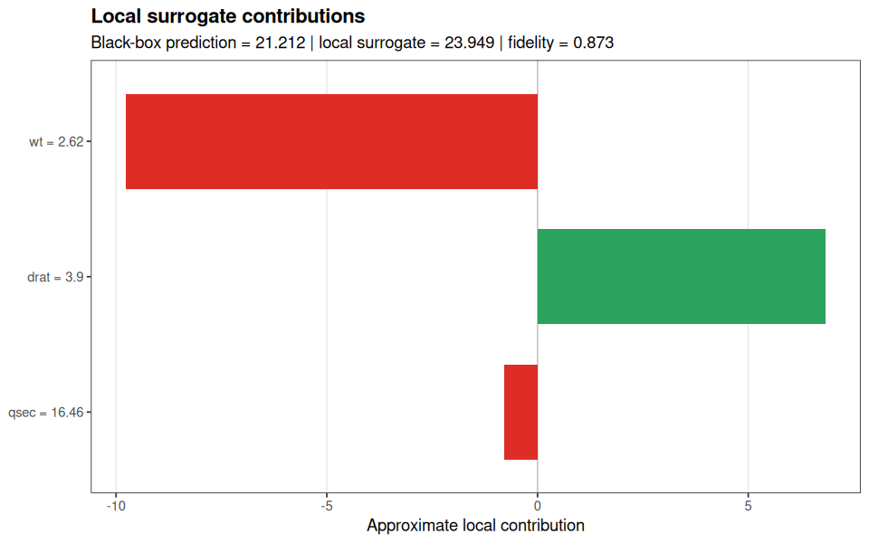
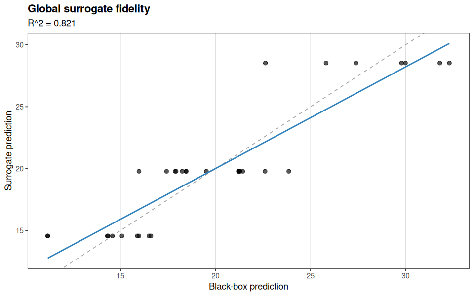
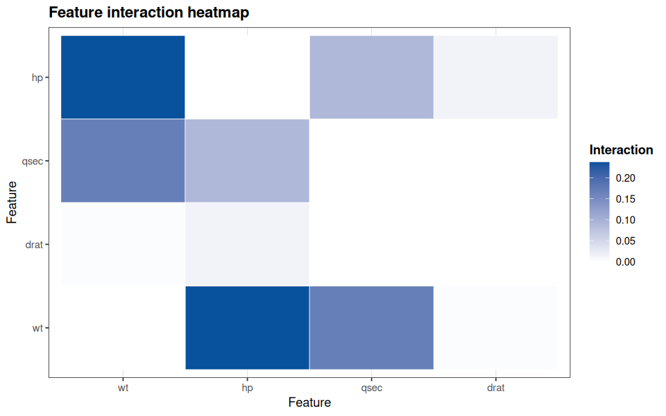
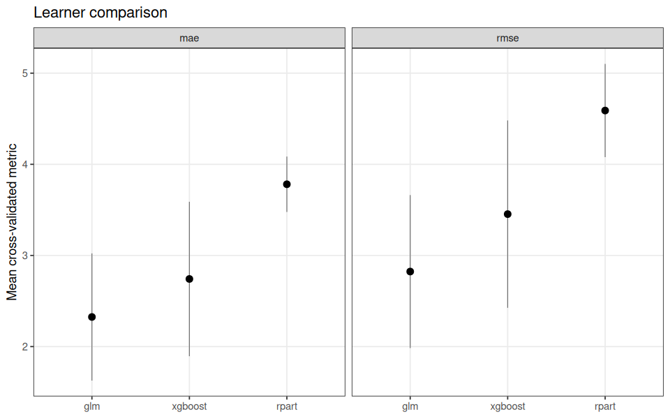

<!-- README.md is generated from README.Rmd. Please edit that file. -->

# funcml

`funcml` is a formula-first functional machine learning package for
building end-to-end modeling workflows with a compact S3 interface.

The package is intentionally opinionated. It is not meant to compete
feature for feature with more established and more complete frameworks
such as `tidymodels`, `mlr3`, or `caret`. The goal is narrower: provide
a compact, explicit, formula-first pipeline for users who want to fit,
compare, tune, interpret, and estimate machine learning models without
adopting a large workflow system.

The package is centered on one workflow:

- `fit()`
- `predict()`
- `learners()`
- `compare_learners()`
- `cv()`
- `evaluate()`
- `tune()`
- `estimate()`
- `interpret()`

Interpretability is included as one part of the package, not the main
purpose.

## Design philosophy

`funcml` is built around a deliberate tradeoff: less framework machinery
in exchange for a more compact, explicit workflow.

- Preprocessing is intentionally outside the package. Data modifications
  should happen before `fit()` so the modeling input is explicit and the
  training step does not hide transformation state.
- The package favors functional composition and clear inputs over
  implicit workflow objects that mutate or learn preprocessing steps
  inside training.
- Cross-validation is the primary resampling strategy because it is the
  default scientific baseline for many supervised learning problems.
  `funcml` focuses on that common case rather than trying to cover every
  specialized resampling design.
- This is a tradeoff, not a universal claim. Users who need richer
  preprocessing orchestration, broader resampling strategies, or larger
  ML ecosystems should use more complete frameworks.

In short, `funcml` is for users who want the most compact pipeline that
still keeps model fitting, evaluation, tuning, interpretability, and
causal estimation in one coherent interface.

## Package context

`funcml` is organized around a single learner registry and a shared S3
modeling surface.

- `fit()` encodes a formula/data pair, dispatches to a learner adapter,
  and returns a `funcml_fit` object with a stored prediction closure.
- `predict()` reuses the stored design-matrix metadata so new data must
  match the fitted feature space exactly.
- `evaluate()` and `tune()` build on the same `fit()` interface.
- `compare_learners()` compares several learners on a shared resampling
  scheme, with optional tuning inside the comparison step.
- `estimate()` performs plug-in g-computation for causal estimands.
- `interpret()` provides native model-agnostic explanations and plot
  methods.

Current learner ids exposed through `learners()` include:

| Task support                       | Learners                                                                                                                                                                  |
|------------------------------------|---------------------------------------------------------------------------------------------------------------------------------------------------------------------------|
| Regression + classification        | `glm`, `rpart`, `glmnet`, `ranger`, `nnet`, `e1071_svm`, `randomForest`, `gbm`, `kknn`, `ctree`, `cforest`, `lightgbm`, `catboost`, `xgboost`, `stacking`, `superlearner` |
| Regression + binary classification | `earth`, `gam`, `bart`                                                                                                                                                    |
| Classification only                | `C50`, `naivebayes`, `fda`, `lda`, `qda`                                                                                                                                  |
| Binary classification only         | `adaboost`                                                                                                                                                                |
| Regression only                    | `pls`                                                                                                                                                                     |

## Current local package status

In this workspace, the source tree is ahead of the older installed
package that `library(funcml)` may pick up from a user library. The
source version includes the expanded learner registry for `gam`, `bart`,
`ctree`, `cforest`, `naivebayes`, `fda`, `adaboost`, and `pls`. This
README is rendered from the current source tree, not the stale installed
copy.

## Full API demonstration with `xgboost`

The example below uses one learner, `xgboost`, across the full exported
API.

``` r
demo_data <- transform(
  mtcars,
  trt = as.integer(wt > median(wt)),
  car = rownames(mtcars)
)

xgb_spec <- list(
  nrounds = 40,
  max_depth = 3,
  eta = 0.1,
  subsample = 1,
  colsample_bytree = 1
)

learners()[grepl("xgboost", learners())]
#> [1] "xgboost"
```

### Fit, predict, and basic metrics

``` r
fit_obj <- fit(
  mpg ~ wt + hp + qsec + drat,
  data = demo_data,
  model = "xgboost",
  spec = xgb_spec,
  seed = 42
)

fit_obj
#> <funcml_fit> regression model: xgboost
#> Formula: mpg ~ wt + hp + qsec + drat
#> Features: 5 | Obs: 32
summary(fit_obj)
#> <funcml_fit summary> regression model: xgboost
#> Spec:
#> $nrounds
#> [1] 40
#> 
#> $max_depth
#> [1] 3
#> 
#> $eta
#> [1] 0.1
#> 
#> $subsample
#> [1] 1
#> 
#> $colsample_bytree
#> [1] 1
```

``` r
pred <- predict(fit_obj, demo_data[1:5, , drop = FALSE])
round(pred, 3)
#> [1] 21.212 21.212 22.625 21.262 17.880
```

``` r
fitted_pred <- predict(fit_obj, demo_data)

data.frame(
  metric = c("rmse", "mae", "rsq"),
  value = c(
    rmse(demo_data$mpg, fitted_pred),
    mae(demo_data$mpg, fitted_pred),
    rsq(demo_data$mpg, fitted_pred)
  )
)
#>   metric     value
#> 1   rmse 0.7069325
#> 2    mae 0.5179982
#> 3    rsq 0.9857980
```

### Cross-validation and evaluation

``` r
resampling <- cv(v = 4, repeats = 2, seed = 42)

eval_obj <- evaluate(
  demo_data,
  mpg ~ wt + hp + qsec + drat,
  model = "xgboost",
  spec = xgb_spec,
  resampling = resampling
)

eval_obj
#> <funcml_eval> model: xgboost | task: regression
#>   metric      mean        sd
#> 1    mae 2.6851715 1.1364892
#> 2   rmse 3.3212659 1.3516883
#> 3    rsq 0.4888104 0.6548592
summary(eval_obj)
#>   metric      mean        sd
#> 1    mae 2.6851715 1.1364892
#> 2   rmse 3.3212659 1.3516883
#> 3    rsq 0.4888104 0.6548592
```

``` r
plot(eval_obj)
```

<div class="figure" style="text-align: center">


<p class="caption">
Cross-validated performance for the xgboost regression workflow.
</p>

</div>

### Hyperparameter tuning

``` r
tune_grid <- expand.grid(
  max_depth = c(2, 3),
  eta = c(0.05, 0.1),
  nrounds = c(20, 40)
)

tune_obj <- tune(
  demo_data,
  mpg ~ wt + hp + qsec + drat,
  model = "xgboost",
  grid = tune_grid,
  resampling = cv(v = 4, seed = 42),
  metric = "rmse",
  subsample = 1,
  colsample_bytree = 1
)

tune_obj
#> <funcml_tune> metric=rmse direction=min
#> Best:
#>   max_depth eta nrounds     mean       sd
#> 7         2 0.1      40 3.219042 1.564248
summary(tune_obj)
#>   max_depth  eta nrounds     mean        sd
#> 1         2 0.05      20 3.750195 1.0025482
#> 2         3 0.05      20 3.730291 1.0077308
#> 3         2 0.10      20 3.443088 0.9637624
#> 4         3 0.10      20 3.417483 1.0506080
#> 5         2 0.05      40 3.414422 0.9530057
#> 6         3 0.05      40 3.426919 1.0539511
#> 7         2 0.10      40 3.219042 1.5642484
#> 8         3 0.10      40 3.300439 1.7181246
```

``` r
plot(tune_obj)
```

<div class="figure" style="text-align: center">


<p class="caption">
Grid-search trace for xgboost.
</p>

</div>

### Causal effect estimation

`estimate()` uses the same learner interface. Here the treatment is the
binary indicator `trt`.

``` r
est_obj <- estimate(
  demo_data,
  mpg ~ trt + hp + qsec + drat,
  model = "xgboost",
  estimand = "ATE",
  spec = xgb_spec,
  seed = 42
)

est_obj
#> <funcml_estimand> ATE via g-computation
#> Treatment: trt (1 vs 0)
#> Estimate: -2.1013 | SE: 0.1308 | 95% CI [-2.3577, -1.8449]
summary(est_obj)
#>       estimand treatment treatment_level control_level  estimate std_error
#> lower      ATE       trt               1             0 -2.101282 0.1308223
#>        conf_low conf_high
#> lower -2.357689 -1.844875
```

``` r
plot(est_obj)
```

<div class="figure" style="text-align: center">


<p class="caption">
Distribution of estimated unit-level treatment effects from plug-in
g-computation.
</p>

</div>

### Native interpretability workflow

#### Permutation importance

``` r
permute_obj <- interpret(
  fit_obj,
  demo_data,
  method = "permute",
  metric = "rmse",
  nsim = 10,
  seed = 42
)

permute_obj
#> <funcml_vi>
#>   feature importance    std_dev
#> 1      wt  5.5581205 0.65221148
#> 2      hp  2.5522424 0.15069575
#> 3    qsec  0.9313675 0.24894509
#> 4    drat  0.4498441 0.09311494
summary(permute_obj)
#>   feature importance    std_dev
#> 1      wt  5.5581205 0.65221148
#> 2      hp  2.5522424 0.15069575
#> 3    qsec  0.9313675 0.24894509
#> 4    drat  0.4498441 0.09311494
```

``` r
plot(permute_obj)
```

<div class="figure" style="text-align: center">


<p class="caption">
Permutation importance for the xgboost model.
</p>

</div>

#### Partial dependence

``` r
pdp_obj <- interpret(
  fit_obj,
  demo_data,
  method = "pdp",
  features = c("wt", "hp")
)

pdp_obj
#> <funcml_pdp>
#>    feature    value     yhat
#> 1       wt 1.513000 29.46053
#> 2       wt 1.652679 29.46053
#> 3       wt 1.792357 29.46053
#> 4       wt 1.932036 28.83368
#> 5       wt 2.071714 27.95257
#> 6       wt 2.211393 28.32804
#> 7       wt 2.351071 21.90604
#> 8       wt 2.490750 19.56653
#> 9       wt 2.630429 19.56653
#> 10      wt 2.770107 19.56653
summary(pdp_obj)
#>    feature      value     yhat
#> 1       wt   1.513000 29.46053
#> 2       wt   1.652679 29.46053
#> 3       wt   1.792357 29.46053
#> 4       wt   1.932036 28.83368
#> 5       wt   2.071714 27.95257
#> 6       wt   2.211393 28.32804
#> 7       wt   2.351071 21.90604
#> 8       wt   2.490750 19.56653
#> 9       wt   2.630429 19.56653
#> 10      wt   2.770107 19.56653
#> 11      wt   2.909786 19.56653
#> 12      wt   3.049464 19.56653
#> 13      wt   3.189143 19.56653
#> 14      wt   3.328821 19.56653
#> 15      wt   3.468500 17.62273
#> 16      wt   3.608179 17.49312
#> 17      wt   3.747857 17.46663
#> 18      wt   3.887536 17.46100
#> 19      wt   4.027214 17.46100
#> 20      wt   4.166893 17.46100
#> 21      wt   4.306571 17.46100
#> 22      wt   4.446250 17.46100
#> 23      wt   4.585929 17.46100
#> 24      wt   4.725607 17.46100
#> 25      wt   4.865286 17.46100
#> 26      wt   5.004964 17.46100
#> 27      wt   5.144643 17.46100
#> 28      wt   5.284321 17.46100
#> 29      wt   5.424000 17.46100
#> 30      hp  52.000000 22.46185
#> 31      hp  65.476190 22.46723
#> 32      hp  78.952381 22.40817
#> 33      hp  92.428571 22.13935
#> 34      hp 105.904762 21.26059
#> 35      hp 119.380952 21.01959
#> 36      hp 132.857143 21.01959
#> 37      hp 146.333333 21.01959
#> 38      hp 159.809524 20.25157
#> 39      hp 173.285714 20.25157
#> 40      hp 186.761905 19.02097
#> 41      hp 200.238095 19.02097
#> 42      hp 213.714286 16.85177
#> 43      hp 227.190476 16.85177
#> 44      hp 240.666667 17.22886
#> 45      hp 254.142857 17.15219
#> 46      hp 267.619048 17.57124
#> 47      hp 281.095238 17.57124
#> 48      hp 294.571429 17.57124
#> 49      hp 308.047619 17.57124
#> 50      hp 321.523810 17.57124
#> 51      hp 335.000000 17.57124
```

``` r
plot(pdp_obj)
```

<div class="figure" style="text-align: center">


<p class="caption">
Partial dependence profiles for `wt` and `hp`.
</p>

</div>

#### ICE curves

``` r
ice_obj <- interpret(
  fit_obj,
  demo_data,
  method = "ice",
  features = "wt",
  nsamples = 20
)

ice_obj
#> <funcml_ice>
#>    id feature    value     yhat
#> 1   1      wt 1.615000 26.86521
#> 2   1      wt 1.839059 26.09034
#> 3   1      wt 2.063118 25.20514
#> 4   1      wt 2.287176 25.57501
#> 5   1      wt 2.511235 15.88685
#> 6   1      wt 2.735294 15.88685
#> 7   1      wt 2.959353 15.88685
#> 8   1      wt 3.183412 15.88685
#> 9   1      wt 3.407471 15.88685
#> 10  1      wt 3.631529 15.07618
summary(ice_obj)
#>     id feature    value     yhat
#> 1    1      wt 1.615000 26.86521
#> 2    1      wt 1.839059 26.09034
#> 3    1      wt 2.063118 25.20514
#> 4    1      wt 2.287176 25.57501
#> 5    1      wt 2.511235 15.88685
#> 6    1      wt 2.735294 15.88685
#> 7    1      wt 2.959353 15.88685
#> 8    1      wt 3.183412 15.88685
#> 9    1      wt 3.407471 15.88685
#> 10   1      wt 3.631529 15.07618
#> 11   1      wt 3.855588 14.85653
#> 12   1      wt 4.079647 14.85653
#> 13   1      wt 4.303706 14.85653
#> 14   1      wt 4.527765 14.85653
#> 15   1      wt 4.751824 14.85653
#> 16   1      wt 4.975882 14.85653
#> 17   1      wt 5.199941 14.85653
#> 18   1      wt 5.424000 14.85653
#> 19   2      wt 1.615000 29.33618
#> 20   2      wt 1.839059 28.56131
#> 21   2      wt 2.063118 27.62514
#> 22   2      wt 2.287176 27.99500
#> 23   2      wt 2.511235 13.27835
#> 24   2      wt 2.735294 13.27835
#> 25   2      wt 2.959353 13.27835
#> 26   2      wt 3.183412 13.27835
#> 27   2      wt 3.407471 13.27835
#> 28   2      wt 3.631529 11.43336
#> 29   2      wt 3.855588 11.16898
#> 30   2      wt 4.079647 11.16898
#> 31   2      wt 4.303706 11.16898
#> 32   2      wt 4.527765 11.16898
#> 33   2      wt 4.751824 11.16898
#> 34   2      wt 4.975882 11.16898
#> 35   2      wt 5.199941 11.16898
#> 36   2      wt 5.424000 11.16898
#> 37   3      wt 1.615000 29.99273
#> 38   3      wt 1.839059 28.87409
#> 39   3      wt 2.063118 28.07107
#> 40   3      wt 2.287176 28.44093
#> 41   3      wt 2.511235 22.69070
#> 42   3      wt 2.735294 22.69070
#> 43   3      wt 2.959353 22.69070
#> 44   3      wt 3.183412 22.69070
#> 45   3      wt 3.407471 22.69070
#> 46   3      wt 3.631529 19.80337
#> 47   3      wt 3.855588 19.84811
#> 48   3      wt 4.079647 19.84811
#> 49   3      wt 4.303706 19.84811
#> 50   3      wt 4.527765 19.84811
#> 51   3      wt 4.751824 19.84811
#> 52   3      wt 4.975882 19.84811
#> 53   3      wt 5.199941 19.84811
#> 54   3      wt 5.424000 19.84811
#> 55   4      wt 1.615000 29.61399
#> 56   4      wt 1.839059 28.83913
#> 57   4      wt 2.063118 27.90386
#> 58   4      wt 2.287176 28.27372
#> 59   4      wt 2.511235 17.17244
#> 60   4      wt 2.735294 17.17244
#> 61   4      wt 2.959353 17.17244
#> 62   4      wt 3.183412 17.17244
#> 63   4      wt 3.407471 17.17244
#> 64   4      wt 3.631529 16.59828
#> 65   4      wt 3.855588 16.49973
#> 66   4      wt 4.079647 16.49973
#> 67   4      wt 4.303706 16.49973
#> 68   4      wt 4.527765 16.49973
#> 69   4      wt 4.751824 16.49973
#> 70   4      wt 4.975882 16.49973
#> 71   4      wt 5.199941 16.49973
#> 72   4      wt 5.424000 16.49973
#> 73   5      wt 1.615000 32.30522
#> 74   5      wt 1.839059 32.30522
#> 75   5      wt 2.063118 31.48401
#> 76   5      wt 2.287176 31.85387
#> 77   5      wt 2.511235 23.85322
#> 78   5      wt 2.735294 23.85322
#> 79   5      wt 2.959353 23.85322
#> 80   5      wt 3.183412 23.85322
#> 81   5      wt 3.407471 23.85322
#> 82   5      wt 3.631529 20.65626
#> 83   5      wt 3.855588 20.70099
#> 84   5      wt 4.079647 20.70099
#> 85   5      wt 4.303706 20.70099
#> 86   5      wt 4.527765 20.70099
#> 87   5      wt 4.751824 20.70099
#> 88   5      wt 4.975882 20.70099
#> 89   5      wt 5.199941 20.70099
#> 90   5      wt 5.424000 20.70099
#> 91   6      wt 1.615000 29.68743
#> 92   6      wt 1.839059 28.91256
#> 93   6      wt 2.063118 27.97729
#> 94   6      wt 2.287176 28.34716
#> 95   6      wt 2.511235 19.27148
#> 96   6      wt 2.735294 19.27148
#> 97   6      wt 2.959353 19.27148
#> 98   6      wt 3.183412 19.27148
#> 99   6      wt 3.407471 19.27148
#> 100  6      wt 3.631529 17.63137
#> 101  6      wt 3.855588 17.67610
#> 102  6      wt 4.079647 17.67610
#> 103  6      wt 4.303706 17.67610
#> 104  6      wt 4.527765 17.67610
#> 105  6      wt 4.751824 17.67610
#> 106  6      wt 4.975882 17.67610
#> 107  6      wt 5.199941 17.67610
#> 108  6      wt 5.424000 17.67610
#> 109  7      wt 1.615000 27.14273
#> 110  7      wt 1.839059 26.36786
#> 111  7      wt 2.063118 25.48267
#> 112  7      wt 2.287176 25.88840
#> 113  7      wt 2.511235 22.45510
#> 114  7      wt 2.735294 22.45510
#> 115  7      wt 2.959353 22.45510
#> 116  7      wt 3.183412 22.45510
#> 117  7      wt 3.407471 22.45510
#> 118  7      wt 3.631529 19.64694
#> 119  7      wt 3.855588 19.69168
#> 120  7      wt 4.079647 19.69168
#> 121  7      wt 4.303706 19.69168
#> 122  7      wt 4.527765 19.69168
#> 123  7      wt 4.751824 19.69168
#> 124  7      wt 4.975882 19.69168
#> 125  7      wt 5.199941 19.69168
#> 126  7      wt 5.424000 19.69168
#> 127  8      wt 1.615000 29.83126
#> 128  8      wt 1.839059 29.05640
#> 129  8      wt 2.063118 28.17120
#> 130  8      wt 2.287176 28.54107
#> 131  8      wt 2.511235 19.51977
#> 132  8      wt 2.735294 19.51977
#> 133  8      wt 2.959353 19.51977
#> 134  8      wt 3.183412 19.51977
#> 135  8      wt 3.407471 19.51977
#> 136  8      wt 3.631529 17.87965
#> 137  8      wt 3.855588 17.92439
#> 138  8      wt 4.079647 17.92439
#> 139  8      wt 4.303706 17.92439
#> 140  8      wt 4.527765 17.92439
#> 141  8      wt 4.751824 17.92439
#> 142  8      wt 4.975882 17.92439
#> 143  8      wt 5.199941 17.92439
#> 144  8      wt 5.424000 17.92439
#> 145  9      wt 1.615000 29.44964
#> 146  9      wt 1.839059 28.67477
#> 147  9      wt 2.063118 27.81441
#> 148  9      wt 2.287176 28.22015
#> 149  9      wt 2.511235 22.56790
#> 150  9      wt 2.735294 22.56790
#> 151  9      wt 2.959353 22.56790
#> 152  9      wt 3.183412 22.56790
#> 153  9      wt 3.407471 22.56790
#> 154  9      wt 3.631529 19.75974
#> 155  9      wt 3.855588 19.80447
#> 156  9      wt 4.079647 19.80447
#> 157  9      wt 4.303706 19.80447
#> 158  9      wt 4.527765 19.80447
#> 159  9      wt 4.751824 19.80447
#> 160  9      wt 4.975882 19.80447
#> 161  9      wt 5.199941 19.80447
#> 162  9      wt 5.424000 19.80447
#> 163 10      wt 1.615000 29.68743
#> 164 10      wt 1.839059 28.91256
#> 165 10      wt 2.063118 28.03050
#> 166 10      wt 2.287176 28.40036
#> 167 10      wt 2.511235 20.80750
#> 168 10      wt 2.735294 20.80750
#> 169 10      wt 2.959353 20.80750
#> 170 10      wt 3.183412 20.80750
#> 171 10      wt 3.407471 20.80750
#> 172 10      wt 3.631529 18.45322
#> 173 10      wt 3.855588 18.49795
#> 174 10      wt 4.079647 18.49795
#> 175 10      wt 4.303706 18.49795
#> 176 10      wt 4.527765 18.49795
#> 177 10      wt 4.751824 18.49795
#> 178 10      wt 4.975882 18.49795
#> 179 10      wt 5.199941 18.49795
#> 180 10      wt 5.424000 18.49795
#> 181 11      wt 1.615000 29.33618
#> 182 11      wt 1.839059 28.56131
#> 183 11      wt 2.063118 27.62514
#> 184 11      wt 2.287176 27.99500
#> 185 11      wt 2.511235 13.27835
#> 186 11      wt 2.735294 13.27835
#> 187 11      wt 2.959353 13.27835
#> 188 11      wt 3.183412 13.27835
#> 189 11      wt 3.407471 13.27835
#> 190 11      wt 3.631529 11.43336
#> 191 11      wt 3.855588 11.16898
#> 192 11      wt 4.079647 11.16898
#> 193 11      wt 4.303706 11.16898
#> 194 11      wt 4.527765 11.16898
#> 195 11      wt 4.751824 11.16898
#> 196 11      wt 4.975882 11.16898
#> 197 11      wt 5.199941 11.16898
#> 198 11      wt 5.424000 11.16898
#> 199 12      wt 1.615000 31.16299
#> 200 12      wt 1.839059 31.16299
#> 201 12      wt 2.063118 30.32008
#> 202 12      wt 2.287176 30.68995
#> 203 12      wt 2.511235 21.43193
#> 204 12      wt 2.735294 21.43193
#> 205 12      wt 2.959353 21.43193
#> 206 12      wt 3.183412 21.43193
#> 207 12      wt 3.407471 21.43193
#> 208 12      wt 3.631529 18.80506
#> 209 12      wt 3.855588 18.84979
#> 210 12      wt 4.079647 18.84979
#> 211 12      wt 4.303706 18.84979
#> 212 12      wt 4.527765 18.84979
#> 213 12      wt 4.751824 18.84979
#> 214 12      wt 4.975882 18.84979
#> 215 12      wt 5.199941 18.84979
#> 216 12      wt 5.424000 18.84979
#> 217 13      wt 1.615000 26.86521
#> 218 13      wt 1.839059 26.09034
#> 219 13      wt 2.063118 25.20514
#> 220 13      wt 2.287176 25.57501
#> 221 13      wt 2.511235 15.88685
#> 222 13      wt 2.735294 15.88685
#> 223 13      wt 2.959353 15.88685
#> 224 13      wt 3.183412 15.88685
#> 225 13      wt 3.407471 15.88685
#> 226 13      wt 3.631529 15.07618
#> 227 13      wt 3.855588 14.85653
#> 228 13      wt 4.079647 14.85653
#> 229 13      wt 4.303706 14.85653
#> 230 13      wt 4.527765 14.85653
#> 231 13      wt 4.751824 14.85653
#> 232 13      wt 4.975882 14.85653
#> 233 13      wt 5.199941 14.85653
#> 234 13      wt 5.424000 14.85653
#> 235 14      wt 1.615000 32.21478
#> 236 14      wt 1.839059 32.21478
#> 237 14      wt 2.063118 31.39357
#> 238 14      wt 2.287176 31.79930
#> 239 14      wt 2.511235 23.79865
#> 240 14      wt 2.735294 23.79865
#> 241 14      wt 2.959353 23.79865
#> 242 14      wt 3.183412 23.79865
#> 243 14      wt 3.407471 23.79865
#> 244 14      wt 3.631529 20.60169
#> 245 14      wt 3.855588 20.64642
#> 246 14      wt 4.079647 20.64642
#> 247 14      wt 4.303706 20.64642
#> 248 14      wt 4.527765 20.64642
#> 249 14      wt 4.751824 20.64642
#> 250 14      wt 4.975882 20.64642
#> 251 14      wt 5.199941 20.64642
#> 252 14      wt 5.424000 20.64642
#> 253 15      wt 1.615000 27.17573
#> 254 15      wt 1.839059 26.40086
#> 255 15      wt 2.063118 25.51567
#> 256 15      wt 2.287176 25.88553
#> 257 15      wt 2.511235 21.21203
#> 258 15      wt 2.735294 21.21203
#> 259 15      wt 2.959353 21.21203
#> 260 15      wt 3.183412 21.21203
#> 261 15      wt 3.407471 21.21203
#> 262 15      wt 3.631529 18.58516
#> 263 15      wt 3.855588 18.62990
#> 264 15      wt 4.079647 18.62990
#> 265 15      wt 4.303706 18.62990
#> 266 15      wt 4.527765 18.62990
#> 267 15      wt 4.751824 18.62990
#> 268 15      wt 4.975882 18.62990
#> 269 15      wt 5.199941 18.62990
#> 270 15      wt 5.424000 18.62990
#> 271 16      wt 1.615000 31.18401
#> 272 16      wt 1.839059 31.18401
#> 273 16      wt 2.063118 30.36280
#> 274 16      wt 2.287176 30.76854
#> 275 16      wt 2.511235 22.60705
#> 276 16      wt 2.735294 22.60705
#> 277 16      wt 2.959353 22.60705
#> 278 16      wt 3.183412 22.60705
#> 279 16      wt 3.407471 22.60705
#> 280 16      wt 3.631529 19.79889
#> 281 16      wt 3.855588 19.84362
#> 282 16      wt 4.079647 19.84362
#> 283 16      wt 4.303706 19.84362
#> 284 16      wt 4.527765 19.84362
#> 285 16      wt 4.751824 19.84362
#> 286 16      wt 4.975882 19.84362
#> 287 16      wt 5.199941 19.84362
#> 288 16      wt 5.424000 19.84362
#> 289 17      wt 1.615000 29.09656
#> 290 17      wt 1.839059 28.32170
#> 291 17      wt 2.063118 27.43963
#> 292 17      wt 2.287176 27.80950
#> 293 17      wt 2.511235 20.80750
#> 294 17      wt 2.735294 20.80750
#> 295 17      wt 2.959353 20.80750
#> 296 17      wt 3.183412 20.80750
#> 297 17      wt 3.407471 20.80750
#> 298 17      wt 3.631529 18.45322
#> 299 17      wt 3.855588 18.49795
#> 300 17      wt 4.079647 18.49795
#> 301 17      wt 4.303706 18.49795
#> 302 17      wt 4.527765 18.49795
#> 303 17      wt 4.751824 18.49795
#> 304 17      wt 4.975882 18.49795
#> 305 17      wt 5.199941 18.49795
#> 306 17      wt 5.424000 18.49795
#> 307 18      wt 1.615000 29.83126
#> 308 18      wt 1.839059 29.05640
#> 309 18      wt 2.063118 28.17120
#> 310 18      wt 2.287176 28.54107
#> 311 18      wt 2.511235 19.51977
#> 312 18      wt 2.735294 19.51977
#> 313 18      wt 2.959353 19.51977
#> 314 18      wt 3.183412 19.51977
#> 315 18      wt 3.407471 19.51977
#> 316 18      wt 3.631529 17.87965
#> 317 18      wt 3.855588 17.92439
#> 318 18      wt 4.079647 17.92439
#> 319 18      wt 4.303706 17.92439
#> 320 18      wt 4.527765 17.92439
#> 321 18      wt 4.751824 17.92439
#> 322 18      wt 4.975882 17.92439
#> 323 18      wt 5.199941 17.92439
#> 324 18      wt 5.424000 17.92439
#> 325 19      wt 1.615000 29.61399
#> 326 19      wt 1.839059 28.83913
#> 327 19      wt 2.063118 27.90386
#> 328 19      wt 2.287176 28.27372
#> 329 19      wt 2.511235 16.68518
#> 330 19      wt 2.735294 16.68518
#> 331 19      wt 2.959353 16.68518
#> 332 19      wt 3.183412 16.68518
#> 333 19      wt 3.407471 16.68518
#> 334 19      wt 3.631529 16.11102
#> 335 19      wt 3.855588 16.01247
#> 336 19      wt 4.079647 16.01247
#> 337 19      wt 4.303706 16.01247
#> 338 19      wt 4.527765 16.01247
#> 339 19      wt 4.751824 16.01247
#> 340 19      wt 4.975882 16.01247
#> 341 19      wt 5.199941 16.01247
#> 342 19      wt 5.424000 16.01247
#> 343 20      wt 1.615000 29.67744
#> 344 20      wt 1.839059 28.90257
#> 345 20      wt 2.063118 28.01647
#> 346 20      wt 2.287176 28.38634
#> 347 20      wt 2.511235 18.64723
#> 348 20      wt 2.735294 18.64723
#> 349 20      wt 2.959353 18.64723
#> 350 20      wt 3.183412 18.64723
#> 351 20      wt 3.407471 18.64723
#> 352 20      wt 3.631529 15.97279
#> 353 20      wt 3.855588 15.97279
#> 354 20      wt 4.079647 15.97279
#> 355 20      wt 4.303706 15.97279
#> 356 20      wt 4.527765 15.97279
#> 357 20      wt 4.751824 15.97279
#> 358 20      wt 4.975882 15.97279
#> 359 20      wt 5.199941 15.97279
#> 360 20      wt 5.424000 15.97279
```

``` r
plot(ice_obj)
```

<div class="figure" style="text-align: center">


<p class="caption">
ICE curves for `wt`.
</p>

</div>

#### ALE

``` r
ale_obj <- interpret(
  fit_obj,
  demo_data,
  method = "ale",
  features = c("wt", "hp")
)

ale_obj
#> <funcml_ale>
#>    feature    value     effect
#> 1       wt  2.15225  3.1152258
#> 2       wt  2.56100  1.0754639
#> 3       wt  2.96550  1.0754639
#> 4       wt  3.24150  1.0754639
#> 5       wt  3.38250 -0.9217351
#> 6       wt  3.49750 -1.3364682
#> 7       wt  3.66250 -1.4172006
#> 8       wt  3.90875 -1.4679898
#> 9       hp 79.70000  2.0142255
#> 10      hp 99.80000  0.8032181
summary(ale_obj)
#>    feature     value     effect
#> 1       wt   2.15225  3.1152258
#> 2       wt   2.56100  1.0754639
#> 3       wt   2.96550  1.0754639
#> 4       wt   3.24150  1.0754639
#> 5       wt   3.38250 -0.9217351
#> 6       wt   3.49750 -1.3364682
#> 7       wt   3.66250 -1.4172006
#> 8       wt   3.90875 -1.4679898
#> 9       hp  79.70000  2.0142255
#> 10      hp  99.80000  0.8032181
#> 11      hp 108.10000  0.7458698
#> 12      hp 116.50000  0.4901986
#> 13      hp 144.00000 -0.2600784
#> 14      hp 171.75000 -0.2177543
#> 15      hp 189.25000 -1.3382934
#> 16      hp 221.75000 -3.5609235
```

``` r
plot(ale_obj)
```

<div class="figure" style="text-align: center">


<p class="caption">
Accumulated local effects for `wt` and `hp`.
</p>

</div>

#### Local surrogate explanation

``` r
local_obj <- interpret(
  fit_obj,
  demo_data,
  method = "local_model",
  newdata = demo_data[1, , drop = FALSE],
  nsamples = 20,
  k = 3
)

local_obj
#> <funcml_iml_local_model>
#>   feature feature.value observed_value encoded_value        beta     effect
#> 1      wt     wt = 2.62           2.62          2.62 -3.72838540 -9.7683698
#> 2    drat    drat = 3.9            3.9          3.90  1.75357748  6.8389522
#> 3    qsec  qsec = 16.46          16.46         16.46 -0.04752917 -0.7823302
summary(local_obj)
#> $results
#>   feature feature.value observed_value encoded_value        beta     effect
#> 1      wt     wt = 2.62           2.62          2.62 -3.72838540 -9.7683698
#> 2    drat    drat = 3.9            3.9          3.90  1.75357748  6.8389522
#> 3    qsec  qsec = 16.46          16.46         16.46 -0.04752917 -0.7823302
#> 
#> $fidelity
#> [1] 0.8729239
#> 
#> $weights
#>   feature feature.value observed_value encoded_value        beta     effect
#> 1      wt     wt = 2.62           2.62          2.62 -3.72838540 -9.7683698
#> 2    drat    drat = 3.9            3.9          3.90  1.75357748  6.8389522
#> 3    qsec  qsec = 16.46          16.46         16.46 -0.04752917 -0.7823302
#> 
#> $sample_weights
#>  [1] 0.8910268 0.7291470 0.8886166 0.8583971 0.6581651 0.5131897 0.6090240
#>  [8] 0.7732090 0.6125644 0.8333808 0.7169042 0.8083353 0.6576999 0.8081060
#> [15] 0.6662910 0.6734094 0.5153928 0.8764694 0.7546212 0.6775814
#> 
#> $model
#> 
#> Call:
#> stats::lm(formula = .local_formula(colnames(X_recode)), data = df, 
#>     weights = .weights)
#> 
#> Coefficients:
#> (Intercept)           wt           hp         qsec         drat  
#>    30.45753     -3.72839     -0.02542     -0.04753      1.75358  
#> 
#> 
#> $local_prediction
#> [1] 23.9493
```

``` r
plot(local_obj)
```

<div class="figure" style="text-align: center">


<p class="caption">
Top local surrogate contributions for the first row.
</p>

</div>

#### SHAP approximation

``` r
shap_obj <- interpret(
  fit_obj,
  demo_data,
  method = "shap",
  newdata = demo_data[1, , drop = FALSE],
  nsim = 30,
  nsamples = 20,
  seed = 42
)

shap_obj
#> <funcml_shap>
#>   observation feature        shap   phi_var baseline prediction feature_value
#> 1           1      wt  1.10991186 2.5953940 17.90246   21.21203          2.62
#> 2           1      hp  1.99376491 6.9207786 17.90246   21.21203           110
#> 3           1    qsec -0.02074833 0.1641907 17.90246   21.21203         16.46
#> 4           1    drat  0.22664289 0.3478303 17.90246   21.21203           3.9
#>   raw_value feature_label
#> 1      2.62     wt = 2.62
#> 2    110.00      hp = 110
#> 3     16.46  qsec = 16.46
#> 4      3.90    drat = 3.9
summary(shap_obj)
#>   observation feature        shap   phi_var baseline prediction feature_value
#> 1           1      wt  1.10991186 2.5953940 17.90246   21.21203          2.62
#> 2           1      hp  1.99376491 6.9207786 17.90246   21.21203           110
#> 3           1    qsec -0.02074833 0.1641907 17.90246   21.21203         16.46
#> 4           1    drat  0.22664289 0.3478303 17.90246   21.21203           3.9
#>   raw_value feature_label
#> 1      2.62     wt = 2.62
#> 2    110.00      hp = 110
#> 3     16.46  qsec = 16.46
#> 4      3.90    drat = 3.9
```

``` r
plot(shap_obj, kind = "waterfall")
```

<div class="figure" style="text-align: center">


<p class="caption">
SHAP waterfall plot for the first row.
</p>

</div>

The SHAP interface also supports additional plot kinds:

- `plot(shap_obj, kind = "summary")` for a SHAP summary / beeswarm view
  when explanations are computed for multiple rows
- `plot(shap_obj, kind = "importance")` or `kind = "bar"` for mean
  absolute SHAP importance
- `plot(shap_obj, kind = "auto")` to choose waterfall for one row and
  summary for multiple rows

#### Global surrogate

``` r
surrogate_obj <- interpret(
  fit_obj,
  demo_data,
  method = "surrogate",
  maxdepth = 2
)

surrogate_obj
#> <funcml_surrogate>
#> n= 32 
#> 
#> node), split, n, deviance, yval
#>       * denotes terminal node
#> 
#> 1) root 32 982.13350 20.06401  
#>   2) wt>=2.3925 25 267.58850 17.69325  
#>     4) hp>=177.5 10  35.03222 14.55964 *
#>     5) hp< 177.5 15  68.89824 19.78232 *
#>   3) wt< 2.3925 7  72.19810 28.53104 *
summary(surrogate_obj)
#> Call:
#> rpart::rpart(formula = form, data = df, method = "anova", control = rpart::rpart.control(maxdepth = maxdepth))
#>   n= 32 
#> 
#>          CP nsplit rel error    xerror      xstd
#> 1 0.6540322      0 1.0000000 1.0414636 0.2422471
#> 2 0.1666352      1 0.3459678 0.6095144 0.1654784
#> 3 0.0100000      2 0.1793326 0.5240388 0.1350470
#> 
#> Variable importance
#>   wt   hp drat qsec 
#>   44   35   18    3 
#> 
#> Node number 1: 32 observations,    complexity param=0.6540322
#>   mean=20.06401, MSE=30.69167 
#>   left son=2 (25 obs) right son=3 (7 obs)
#>   Primary splits:
#>       wt   < 2.3925 to the right, improve=0.6540322, (0 missing)
#>       hp   < 118    to the right, improve=0.6236706, (0 missing)
#>       drat < 3.75   to the left,  improve=0.4338391, (0 missing)
#>       qsec < 18.41  to the left,  improve=0.3459547, (0 missing)
#>   Surrogate splits:
#>       hp   < 94     to the right, agree=0.938, adj=0.714, (0 split)
#>       drat < 4      to the left,  agree=0.875, adj=0.429, (0 split)
#> 
#> Node number 2: 25 observations,    complexity param=0.1666352
#>   mean=17.69325, MSE=10.70354 
#>   left son=4 (10 obs) right son=5 (15 obs)
#>   Primary splits:
#>       hp   < 177.5  to the right, improve=0.6116034, (0 missing)
#>       wt   < 3.49   to the right, improve=0.5837228, (0 missing)
#>       qsec < 18.45  to the left,  improve=0.4019952, (0 missing)
#>       drat < 3.58   to the left,  improve=0.3376883, (0 missing)
#>   Surrogate splits:
#>       wt   < 3.545  to the right, agree=0.92, adj=0.8, (0 split)
#>       qsec < 15.455 to the left,  agree=0.72, adj=0.3, (0 split)
#>       drat < 3.075  to the left,  agree=0.72, adj=0.3, (0 split)
#> 
#> Node number 3: 7 observations
#>   mean=28.53104, MSE=10.31401 
#> 
#> Node number 4: 10 observations
#>   mean=14.55964, MSE=3.503222 
#> 
#> Node number 5: 15 observations
#>   mean=19.78232, MSE=4.593216 
#> 
#> n= 32 
#> 
#> node), split, n, deviance, yval
#>       * denotes terminal node
#> 
#> 1) root 32 982.13350 20.06401  
#>   2) wt>=2.3925 25 267.58850 17.69325  
#>     4) hp>=177.5 10  35.03222 14.55964 *
#>     5) hp< 177.5 15  68.89824 19.78232 *
#>   3) wt< 2.3925 7  72.19810 28.53104 *
#> Call:
#> rpart::rpart(formula = form, data = df, method = "anova", control = rpart::rpart.control(maxdepth = maxdepth))
#>   n= 32 
#> 
#>          CP nsplit rel error    xerror      xstd
#> 1 0.6540322      0 1.0000000 1.0414636 0.2422471
#> 2 0.1666352      1 0.3459678 0.6095144 0.1654784
#> 3 0.0100000      2 0.1793326 0.5240388 0.1350470
#> 
#> Variable importance
#>   wt   hp drat qsec 
#>   44   35   18    3 
#> 
#> Node number 1: 32 observations,    complexity param=0.6540322
#>   mean=20.06401, MSE=30.69167 
#>   left son=2 (25 obs) right son=3 (7 obs)
#>   Primary splits:
#>       wt   < 2.3925 to the right, improve=0.6540322, (0 missing)
#>       hp   < 118    to the right, improve=0.6236706, (0 missing)
#>       drat < 3.75   to the left,  improve=0.4338391, (0 missing)
#>       qsec < 18.41  to the left,  improve=0.3459547, (0 missing)
#>   Surrogate splits:
#>       hp   < 94     to the right, agree=0.938, adj=0.714, (0 split)
#>       drat < 4      to the left,  agree=0.875, adj=0.429, (0 split)
#> 
#> Node number 2: 25 observations,    complexity param=0.1666352
#>   mean=17.69325, MSE=10.70354 
#>   left son=4 (10 obs) right son=5 (15 obs)
#>   Primary splits:
#>       hp   < 177.5  to the right, improve=0.6116034, (0 missing)
#>       wt   < 3.49   to the right, improve=0.5837228, (0 missing)
#>       qsec < 18.45  to the left,  improve=0.4019952, (0 missing)
#>       drat < 3.58   to the left,  improve=0.3376883, (0 missing)
#>   Surrogate splits:
#>       wt   < 3.545  to the right, agree=0.92, adj=0.8, (0 split)
#>       qsec < 15.455 to the left,  agree=0.72, adj=0.3, (0 split)
#>       drat < 3.075  to the left,  agree=0.72, adj=0.3, (0 split)
#> 
#> Node number 3: 7 observations
#>   mean=28.53104, MSE=10.31401 
#> 
#> Node number 4: 10 observations
#>   mean=14.55964, MSE=3.503222 
#> 
#> Node number 5: 15 observations
#>   mean=19.78232, MSE=4.593216
```

``` r
plot(surrogate_obj)
```

<div class="figure" style="text-align: center">


<p class="caption">
Global surrogate model view.
</p>

</div>

#### Interaction strength

``` r
interaction_obj <- interpret(
  fit_obj,
  demo_data,
  method = "interaction",
  nsamples = 20,
  grid_size = 8
)

interaction_obj
#> <funcml_interaction>
#>   feature interaction
#> 1      wt 0.136738112
#> 2      hp 0.114104074
#> 3    qsec 0.086276242
#> 4    drat 0.006488173
summary(interaction_obj)
#>   feature interaction
#> 1      wt 0.136738112
#> 2      hp 0.114104074
#> 3    qsec 0.086276242
#> 4    drat 0.006488173
```

``` r
plot(interaction_obj)
```

<div class="figure" style="text-align: center">


<p class="caption">
Estimated interaction strength by feature.
</p>

</div>

## Comparing multiple learners

`compare_learners()` compares several models directly, or tunes each one
first and then compares the tuned best configurations on one or more
metrics.

``` r
compare_obj <- compare_learners(
  demo_data,
  mpg ~ wt + hp + qsec,
  models = c("glm", "rpart", "xgboost"),
  metrics = c("rmse", "mae"),
  resampling = cv(v = 4, seed = 42),
  specs = list(
    xgboost = list(nrounds = 20, max_depth = 3, eta = 0.1, subsample = 1, colsample_bytree = 1)
  )
)

compare_obj
#> <funcml_compare> task: regression | tuned: FALSE
#>     model metric     mean        sd tuned rank
#> 1     glm    mae 2.324837 0.6977166 FALSE    1
#> 2     glm   rmse 2.823282 0.8391539 FALSE    1
#> 3   rpart    mae 3.781101 0.3039781 FALSE    3
#> 4   rpart   rmse 4.589988 0.5112815 FALSE    3
#> 5 xgboost    mae 2.741977 0.8471626 FALSE    2
#> 6 xgboost   rmse 3.453442 1.0279252 FALSE    2
summary(compare_obj)
#>     model metric     mean        sd tuned rank
#> 1     glm    mae 2.324837 0.6977166 FALSE    1
#> 2     glm   rmse 2.823282 0.8391539 FALSE    1
#> 3   rpart    mae 3.781101 0.3039781 FALSE    3
#> 4   rpart   rmse 4.589988 0.5112815 FALSE    3
#> 5 xgboost    mae 2.741977 0.8471626 FALSE    2
#> 6 xgboost   rmse 3.453442 1.0279252 FALSE    2
```

``` r
plot(compare_obj)
```

<div class="figure" style="text-align: center">


<p class="caption">
Side-by-side learner comparison across multiple metrics.
</p>

</div>

``` r
compare_tuned_obj <- compare_learners(
  demo_data,
  mpg ~ wt + hp + qsec,
  models = c("rpart", "xgboost"),
  tune = TRUE,
  metric = "rmse",
  metrics = c("rmse", "mae"),
  grids = list(
    rpart = expand.grid(cp = c(0.001, 0.01), minsplit = c(5, 10)),
    xgboost = expand.grid(max_depth = c(2, 3), eta = c(0.05, 0.1), nrounds = c(10, 20))
  ),
  resampling = cv(v = 4, seed = 42),
  subsample = 1,
  colsample_bytree = 1
)

compare_tuned_obj
#> <funcml_compare> task: regression | tuned: TRUE
#>     model metric     mean        sd tuned
#> 1   rpart    mae 2.548437 0.9101399  TRUE
#> 2   rpart   rmse 3.291912 1.2738673  TRUE
#> 3 xgboost    mae 2.770873 0.8394140  TRUE
#> 4 xgboost   rmse 3.448358 0.9195461  TRUE
#>                                                           best_spec opt_metric
#> 1             cp=0.001, minsplit=5, subsample=1, colsample_bytree=1       rmse
#> 2             cp=0.001, minsplit=5, subsample=1, colsample_bytree=1       rmse
#> 3 nrounds=20, max_depth=2, eta=0.1, subsample=1, colsample_bytree=1       rmse
#> 4 nrounds=20, max_depth=2, eta=0.1, subsample=1, colsample_bytree=1       rmse
#>   rank
#> 1    1
#> 2    1
#> 3    2
#> 4    2
summary(compare_tuned_obj)
#>     model metric     mean        sd tuned
#> 1   rpart    mae 2.548437 0.9101399  TRUE
#> 2   rpart   rmse 3.291912 1.2738673  TRUE
#> 3 xgboost    mae 2.770873 0.8394140  TRUE
#> 4 xgboost   rmse 3.448358 0.9195461  TRUE
#>                                                           best_spec opt_metric
#> 1             cp=0.001, minsplit=5, subsample=1, colsample_bytree=1       rmse
#> 2             cp=0.001, minsplit=5, subsample=1, colsample_bytree=1       rmse
#> 3 nrounds=20, max_depth=2, eta=0.1, subsample=1, colsample_bytree=1       rmse
#> 4 nrounds=20, max_depth=2, eta=0.1, subsample=1, colsample_bytree=1       rmse
#>   rank
#> 1    1
#> 2    1
#> 3    2
#> 4    2
```

## Notes on local development

- `testthat::test_local(".")` passes against the source tree.
- A direct `library(funcml)` call may still resolve to an older
  installed copy until the package is reinstalled from this source
  checkout.
